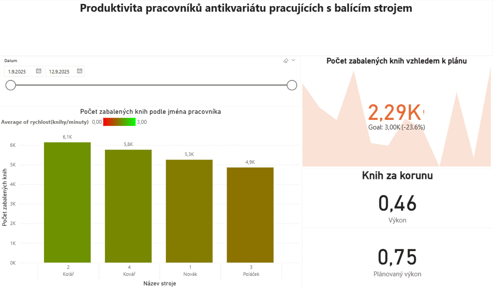
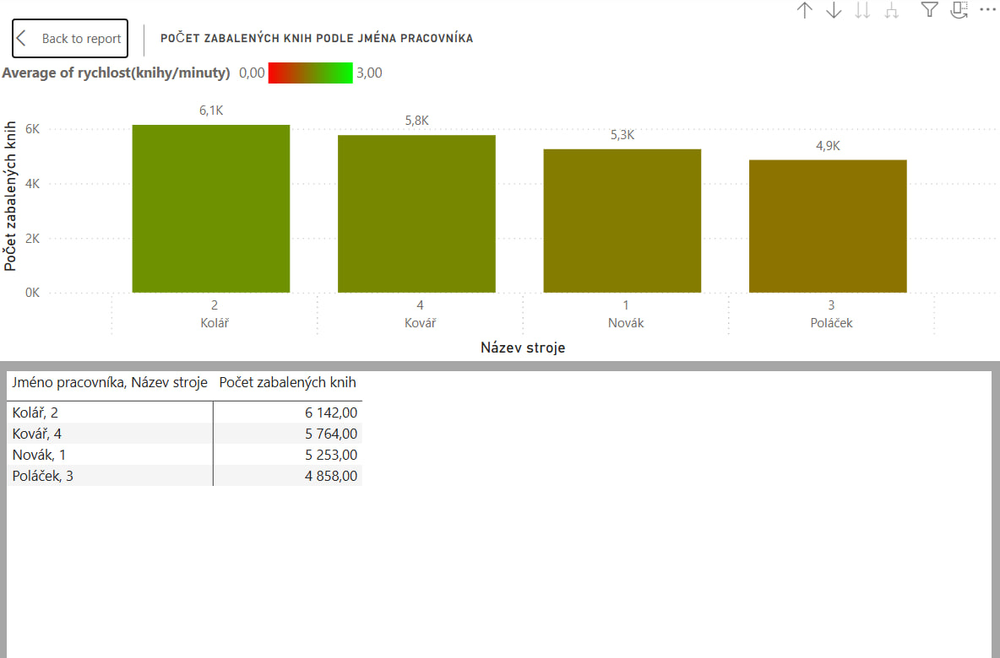
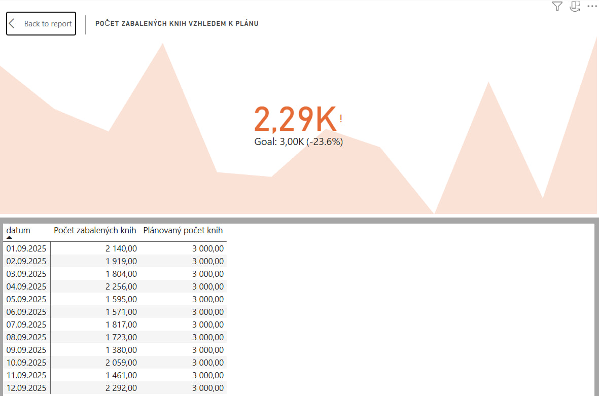

# Produktivita pracovniků pracujících s balícím strojem v antikvariátu – Power BI dashboard – Přehled
## Úvod
Každá továrna s knihami nebo jiným zbožím se může setkat s problémy, že nesplňuje stanovený plán. Manažer může rozhodnout, že pro zvýšení efektivity je nejvhodnější koupit nový stroj, protože čím více je strojů, tím více bude zboží zpracováno. Je ale dané rozhodnutí nejlepší? Abychom mohli odpovědět na tuto otázku, je potřeba provést analýzu každého stroje, jak dobře splňuje stanovený plán. Pokud výsledky jsou podprůměrné, nelze vyřešit problém tím, že se zakoupí nový stroj.
Jaké řešení má manažer přijmout?
Na to mu může pomocí odpovědět daná aplikace, která má dva cíle:
1. Stanovit plán, jak rychle má každý pracovník pracovat, a monitorovat jeho dosažení,
2. Určit pracovníky, kteří mají podprůměrné výsledky, aby mohli být nahrazeni efektivnějším, a nadprůměrné výsledky, aby získali odměnu.

## Struktura projektu
1. Popis datového modelu
2. Předzpracování datového modelu v PowerBI
3. Popis dashboardu
4. Výsledky
5. Jak otevřit aplikaci

## Popis datového modelu
Datový model se skládá z 4 dimenzí a 1 faktové tabulky

**Dimenze**:
1. DimDatum: obsahuje informace o datumech, kdy pracovníci přicházejí do práce
2. DimPracovnik: obsahuje jméno a přijmení pracovníka
3. DimStroj: obsahuje informace o pořadí stroje, datumu a ceně pořízení a prodeje
4. DimPlanSkutecnost: dimenze rozlišuje plánované a skutečné hodnoty pro pracovníka

**Faktové tabulky**: 
FBaleniKnih: vyjádřuje pracovní proces a obsahuje identifikátory dimenzí, časové hodnoty pracovníka, stanovenou mzdu, počet zabalených knih podle plánu a skutečnosti a rychlost vyjádřenou v knihách za minutu. Plánovaná rychlost je předem stanovená, zbytek zaleží na skutečném počtu zabalených knih. 

## Předzpracování datového modelu v PowerBI
V rámci předzpracování bylo provedeno čištění dat. Pro časové hodnoty byl zvolen přislušný typ a formát dat. Dále podle DAX vzorců byl vytvořen sloupec, který počítá náklady na hlavní činnost, a metriky.

### DAX vzorce
naklady_na_hlavni_praci = FBaleniKnih[cisty_cas_prevedeny_na_minuty]*12

planovany_pocet_knih = CALCULATE(SUM(FBaleniKnih[pocet_zabalenych_knih]), DimPlanSkutecnost["Stav"] = "Plán")

vykon = CALCULATE(SUM(FBaleniKnih[pocet_zabalenych_knih])/SUM(FBaleniKnih[naklady_na_hlavni_praci]), DimPlanSkutecnost[Stav] = "Skutečnost")

### Klíčové metriky
**Plánovaný počet knih**: metrika, která počítá, kolik knih se očekává, že bude zpracováno s ohledem na pracovní dobu očištěnou od vedlejších pracovních činností a stanovenou rychlost vyjádřenou knihy/minuty.

**Výkon**: metrika, která počítá, kolik knih zpracuje pracovník za jednu korunu čistého pracovního času.

**Počet zabalených knih vzhledem k plánu**: metrika, která ukazuje trend, jak pracovníci plní plán.

## Popis dashboardu
Dashboard obsahuje název, přůřez v čase, sloupcový graf a dvě klíčové metriky.
Sloupcový graf má na ose X jméno pracovníka a název stroje, na ose Y počet zabalených knih. Každý sloupec má barvu v závislosti na gradaci, kde červená barva znamená rychlost 0 knih/min, zelená barva znamená nejvyšší možnou hodnotu rychlosti.
Mezi zkoumané metriky v dashboardu patří výkon pracovníka a počet zabalených knih vzhledem k plánu.
### Dashboard

### Ukázka grafu

### Ukázka KPI

## Výsledky
S ohledem na to, že všechna data jsou fiktivní a počet zabalených knih byl určen generátorem náhodných čísel pro testovací účely, bylo zjištěno, že nejlépe pracoval Jakub Kolář, který za dobu od 1. do 12. září zpracoval 6142 knih a má výkon 0,51 knih za korunu, nejhorší výsledky má Martin Poláček s počtem knih 4858 a výkonem 0,40 knih za korunu. Průměrný výkon tvoří 0,46 knih za korunu. Plán tvoří 2,5 knihy za minutu.

## Jak používat aplikaci
1. Stáhnout repozitář.
2. Otevřit aplikaci v [**PowerBI Desktop**](https://www.microsoft.com/en-us/power-platform/products/power-bi/desktop).
3. Zkoumat dashboard a sledovat výkon stroje a jména pracovníka v čase
